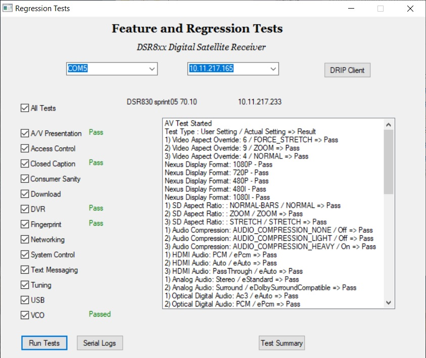

## Useful for running Regression Tests on an 8xx

The GUI screen for the test station looks like the following:

To run this scipt, the following are requirements:
- Windows PC
- Python installed on your PC
- Optional: AutoIt installed on your PC to make modifications

You also need to connect to your 8xx with both serial and ethernet connections.  

This web page can be edited at [editor on GitHub](https://github.com/1Bob-coder/test-station/edit/gh-pages/index.md).  And whenever you commit to this repository, GitHub Pages will run [Jekyll](https://jekyllrb.com/) to rebuild the pages in your site, from the content in your Markdown files.  For more details see [GitHub Flavored Markdown](https://guides.github.com/features/mastering-markdown/).
